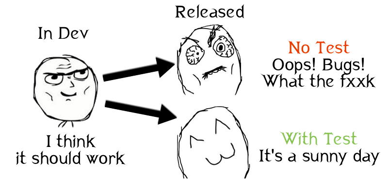

# TDD的开发及Quick的使用

测试驱动开发(Test Driven Development，以下简称TDD)是保证代码质量的不二法则，也是先进程序开发的共识。Apple一直致力于在开发中集成更加方便和可用的测试，新工程将自动包含测试的target，并且相关框架也搭建完毕，可以说测试终于摆脱了开发中“二等公民”的地位，现在已经变得和产品代码一样重要了。如果能够使用TDD来进行开发，不仅能保证代码运行的正确性，也有助于代码结构的安排和思考，有助于自身的不断提高。

而[Quick](https://github.com/Quick/Quick)是一个apple平台十分好用的行为驱动开发(Behavior Driven Development，以下简称BDD)的测试框架，有着非常漂亮的语法，可以写出结构性强，非常容易读懂的测试。开始先简单地介绍一些TDD的概念和思想，然后从XCTest的最简单的例子开始，过渡到[Quick](https://github.com/Quick/Quick)的测试世界。

## 什么是TDD，为什么我们要TDD

测试驱动开发并不是一个很新鲜的概念了。软件开发工程师们（当然包括你我）最开始学习程序编写时，最喜欢干的事情就是编写一段代码，然后运行观察结果是否正确。如果不对就返回代码检查错误，或者是加入断点或者输出跟踪程序并找出错误，然后再次运行查看输出是否与预想一致。
如果输出只是控制台的一个简单的数字或者字符那还好，但是如果输出必须在点击一系列按钮之后才能在屏幕上显示出来的东西呢？难道我们就只能一次一次地等待编译部署，启动程序然后操作UI，一直点到我们需要观察的地方么？这种行为无疑是对美好生命和绚丽青春的巨大浪费。于是有一些已经浪费了无数时间的资深工程师们突然发现，原来我们可以在代码中构建出一个类似的场景，然后在代码中调用我们之前想检查的代码，并将运行的结果与我们的设想结果在程序中进行比较，如果一致，则说明了我们的代码没有问题，是按照预期工作的。

我们做出某些条件和假设，并以其为条件使用到被测试代码中，并比较预期的结果和实际运行的结果是否相等，这就是软件开发中测试的基本方式。



而TDD是一种相对于普通思维的方式来说，比较极端的一种做法。在TDD的世界中，我们应该首先根据需求或者接口情况编写测试，然后再根据测试来编写业务代码，而这其实是违反传统软件开发中的先验认知的。TDD的好处不言自明，因为总是先测试，再编码，所以至少你的所有代码的public部分都应该含有必要的测试。另外，因为测试代码实际是要使用产品代码的，因此在编写产品代码前你将有一次深入思考和实践如何使用这些代码的机会，这对提高设计和可扩展性有很好的帮助，试想一下你测试都很难写的接口，别人（或者自己）用起来得多纠结。在测试的准绳下，你可以有目的有方向地编码；另外，因为有测试的保护，你可以放心对原有代码进行重构，而不必担心破坏逻辑。这些其实都指向了一个最终的目的：让我们快乐安心高效地工作。

## [在Xcode项目中使用测试](https://github.com/Quick/Quick/blob/master/Documentation/en-us/SettingUpYourXcodeProject.md#testing-swift-code-using-swift)

## 使用XCTest来执行TDD

Xcode中已经集成了XCTest的测试框架，所谓测试框架，就是一组让“将测试集成到工程中”以及“编写和实践测试”变得简单的库。

### 使用XCTest进行有效测试：布置，扮演，断言

不管你用的XCTest、Quick或者其它的测试框架，你都可以遵循一个简单的模式来写出有效的单元测试：
1. 布置
2. 扮演
3. 断言

举个栗子，我们先看一个简单类`Banana`

```swift

// Banana/Banana.swift

/// A delicious banana. Tastes better if you peel it first.
public class Banana {
    private var isPeeled = false

    /// Peels the banana.
    public func peel() {
        isPeeled = true
    }

    /// You shouldn't eat a banana unless it's been peeled.
    public var isEdible: Bool {
        return isPeeled
    }
}

```

让我们验证`Banana.peel()`确实和预期表现一样

```swift

// BananaTests/BananaTests.swift

import XCTest
@testable import BDDQuick

class BananaTests: XCTestCase {

    func testPeel_makesTheBananaEdible() {

        // Arrange: Create the banana we'll be peeling.
        let banana = Banana()

        // Act: Peel the banana.
        banana.peel()

        // Assert: Verify that the banana is now edible.
        XCTAssertTrue(banana.isEdible)

    }

}

```


## Quick和BDD的测试思想

### XCTest测试的缺点

1. 各个测试方法是割裂的: 难于找到并搞明白这个测试是做什么的
2. 所有测试都是由断言完成的: 断言的意义并不是特别的明确，项目交付或新的开发人员加入时，需要很大成本进行理解和转换；每一个测试的描述都被写在断言之后，夹杂在代码之中，难以寻找
3. 难以进行**mock、stub**

### BDD的优点
行为驱动开发（BDD）正是为了解决上述问题而生的
1. 将测试语句转换为类似自然语言的描述，BDD更像是在讲故事，一个典型的BDD的测试用例包活完整的三段式上下文，测试大多可以翻译为Given..When..Then的格式

### [在项目中添加Quick](https://github.com/Quick/Quick/blob/master/Documentation/en-us/InstallingQuick.md)

```ruby

# Podfile

use_frameworks!

def testing_pods
  pod 'Quick'
  pod 'Nimble'
end

target 'MyTests' do
  testing_pods
end

target 'MyUITests' do
  testing_pods
end

```

### simple example

```swift

import Foundation
import Quick
import Nimble

class SimpleStringSpec: QuickSpec {

    override func spec() {

        describe("SimpleString") {
            let greeting = "Hello world"
            it("should exist", closure: {
                expect(greeting).notTo(beNil())
            })

            it("should equal to 'Hello world'", closure: {
                expect(greeting).to(equal("Hello world"))
            })
        }

    }

}

```
### 不要测试代码，测试行为

比如保存一个香蕉到数据库

#### 脆弱的测试

```swift
func testSave_savesTheBananaToTheDatabase() {
    // Arrange: Create a database and get its original size.
    let database = GorillaDB()
    let originalSize = database.size

    // Act: Save a banana to the database.
    let banana = Banana()
    database.save(banana: banana, key: "test-banana")

    // Assert: The size of the database should have increased by one.
    XCTAssertEqual(database.size, originalSize + 1)
}
```

#### 行为测试

```swift
func testSave_savesTheBananaToTheDatabase() {
    // Arrange: Create a database and get its original size.
    let database = GorillaDB()

    // Act: Save a banana to the database.
    let banana = Banana()
    database.save(banana: banana, key: "test-banana")
    // Assert: The bananas saved to and loaded from the database should be the same.
    XCTAssertEqual(database.load(key: "test-banana"), banana)
}
```

1. 脆弱的测试：个数应该加1，显然是不合理的

2. 行为测试：数据库应该有这个香蕉，可以查到这个香蕉

行为测试的关键是：
  确定你期望你的代码做什么。
  测试代码是否会覆盖到代码做什么的其它方面。

### Nimble Assertions
Nimble有类似自然语言的语法

```swift

func testSilliest_whenMonkeysContainSillyMonkeys_theyreIncludedInTheResult() {
  let kiki = Monkey(name: "Kiki", silliness: .ExtremelySilly)
  let carl = Monkey(name: "Carl", silliness: .NotSilly)
  let jane = Monkey(name: "Jane", silliness: .VerySilly)
  let sillyMonkeys = silliest([kiki, carl, jane])
-  XCTAssertTrue(contains(sillyMonkeys, kiki), "Expected sillyMonkeys to contain 'Kiki'")
+  expect(sillyMonkeys).to(contain(kiki))
}

```
我们不用自己写测试的`failure message`，因为nimble提供的已经非常易读

```
expected to contain <Monkey(name: Kiki, sillines: ExtremelySilly)>,
                got <[Monkey(name: Jane, silliness: VerySilly)]>

```

### 测试可读性: `Quick`和`XCTest`

`XCTest`

```swift
func testDolphin_click_whenTheDolphinIsNearSomethingInteresting_isEmittedThreeTimes() {
  // ...
}
```

`Quick`

```swift
describe("a dolphin") {
  describe("its click") {
    context("when the dolphin is near something interesting") {
      it("is emitted three times") {
        // ...
      }
    }
  }
}
```

### [QuickExample和Groups](https://github.com/Quick/Quick/blob/master/Documentation/en-us/QuickExamplesAndGroups.md)

```swift

import XCTest
import Nimble
import Quick
@testable import BDDQuick

class DolphinSpec: QuickSpec {

    override func spec() {
        it("is friendly") {
            expect(Dolphin().isFriendly).to(beTruthy())
        }

        it("is smart") {
            expect(Dolphin().isSmart).to(beTruthy())
        }
    }

}

```

### [测试 OS X 和 iOS Applications](https://github.com/Quick/Quick/blob/master/Documentation/en-us/TestingApps.md)

``` swift

class BananaViewControllerSpec: QuickSpec {

    override func spec() {
        var viewController: BananaViewController!

        beforeEach {
            // 1. Instantiate the storyboard. By default, it's name is "Main.storyboard".
            //    You'll need to use a different string here if the name of your storyboard is different.
            let storyboard = UIStoryboard(name: "Main", bundle: nil)
            // 2. Use the storyboard to instantiate the view controller.
            viewController = storyboard.instantiateViewController(withIdentifier: "BananaViewControllerID") as! BananaViewController

        }

        describe("-viewDidLoad") {
            beforeEach {
                // Method #1: Access the view to trigger -[BananaViewController viewDidLoad].
                let _ = viewController.view
            }

            it("sets the banana count label to zero", closure: {
                // Since the label is only initialized when the view is loaded, this
                // would fail if we didn't access the view in the `beforeEach` above.
                expect(viewController.bananaCountLabel.text).to(equal("0"))
            })
        }

        describe("the view") {
            beforeEach {
                // Method #2: Triggers .viewDidLoad(), .viewWillAppear(), and .viewDidAppear() events.
                viewController.beginAppearanceTransition(true, animated: false)
                viewController.endAppearanceTransition()
            }
        }

        describe(".viewWillDisappear()") {
            beforeEach {
                // Method #3: Directly call the lifecycle event.
                viewController.viewWillDisappear(false)
            }
        }

        // MARK: - Triggering UIControl Events Like Button Taps

        describe("the 'more bananas' button") {
            beforeEach {
                // Method #1: Access the view to trigger -[BananaViewController viewDidLoad].
                let _ = viewController.view
            }

            it("increments the banana count label when tapped", closure: {
                viewController.moreButton.sendActions(for: .touchUpInside)
                expect(viewController.bananaCountLabel.text).to(equal("1"))
            })
        }

    }

}

```

### [Writing test with Mock in Swift](https://github.com/Quick/Quick/blob/master/Documentation/en-us/TestUsingTestDoubles.md#mock)

```swift

class ViewControllerSpec: QuickSpec {

    override func spec() {
        describe("view Controller") {
            it("fetch data with data provider", closure: {
                let mockProvider = MockDataProvider()

                let viewController = UIStoryboard(name: "Main", bundle: nil).instantiateViewController(withIdentifier: "ViewController") as! ViewController
                viewController.dataProvider = mockProvider

                expect(mockProvider.fetchCalled).to(equal(false))

                let _ = viewController.view

                expect(mockProvider.fetchCalled).to(equal(true))

            })
        }
    }

}

```

### [Asynchronous Expectations](https://github.com/Quick/Nimble#asynchronous-expectations)

```swift

class AsynchronousSpec: QuickSpec {

    override func spec() {

        var ocean: [String]!

        beforeEach {
            ocean = []
        }

        it("Asynchronous Expectations") {

            DispatchQueue.main.async {
                ocean.append("dolphins")
                ocean.append("whales")
            }

            expect(ocean).toEventually(contain("dolphins", "whales"), timeout: 3)

        }
    }

}

```

更多请看Example

参考:

1. [TDD的iOS开发初步以及Kiwi使用入门](https://onevcat.com/2014/02/ios-test-with-kiwi/)
2. [Quick Documentation](https://github.com/Quick/Quick/tree/master/Documentation)


## License

QuickDemo is released under the MIT license. See LICENSE for details.
